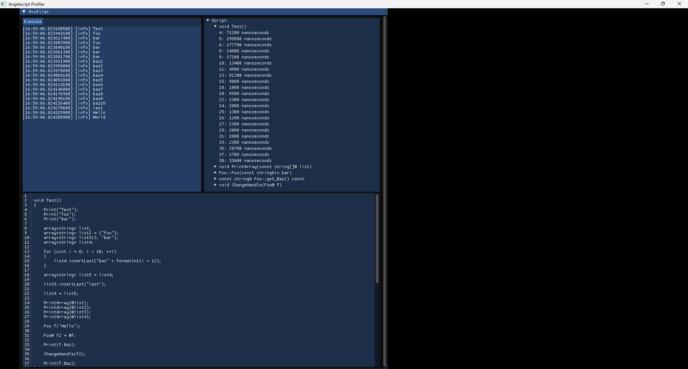

# Angelscript Profiler

This is a basic profiler for Angelscript. It must be integrated into an application to work in order to access the Angelscript context instance.

To use the profiler the engine property `asEP_BUILD_WITHOUT_LINE_CUES` must be disabled since line callbacks require line cues.

The profiler works by measuring the time elapsed between lines of code as they are executed.
Some edge cases exist where measuring execution isn't perfectly accurate like when native code executes or when constructors initialize members.

Timing accuracy depends on the accuracy of the clock used.

The profiler itself is defined in `src/as/ScriptProfiler.hpp` and `src/as/ScriptProfiler.cpp`. All other code is used to set up dependencies and Angelscript. A simple UI is shown using ImGui, but for more complex usage a retained mode GUI framework is recommended.

Example:

# Setup

This project uses CMake in conjunction with vcpkg. vcpkg is used as a submodule; you must recursively check out the Git repository to acquire it.

The vcpkg toolchain file is set automatically, all CMake options should be left to their default. Configuration files for vcpkg for 64 bit Windows are included, but not other platforms.

# Dependencies

* SDL2 2.30.10
* ImGui (commit 6982ce43f5b143c5dce5fab0ce07dd4867b705ae)
* ImPlot (commit fc3b781634f337d618efd5f05d051f2e536d7296) (Not used, but may be useful for displaying statistics)
* Angelscript 2.37.0
* spdlog 1.15.0

# License

See [LICENSE](LICENSE)
